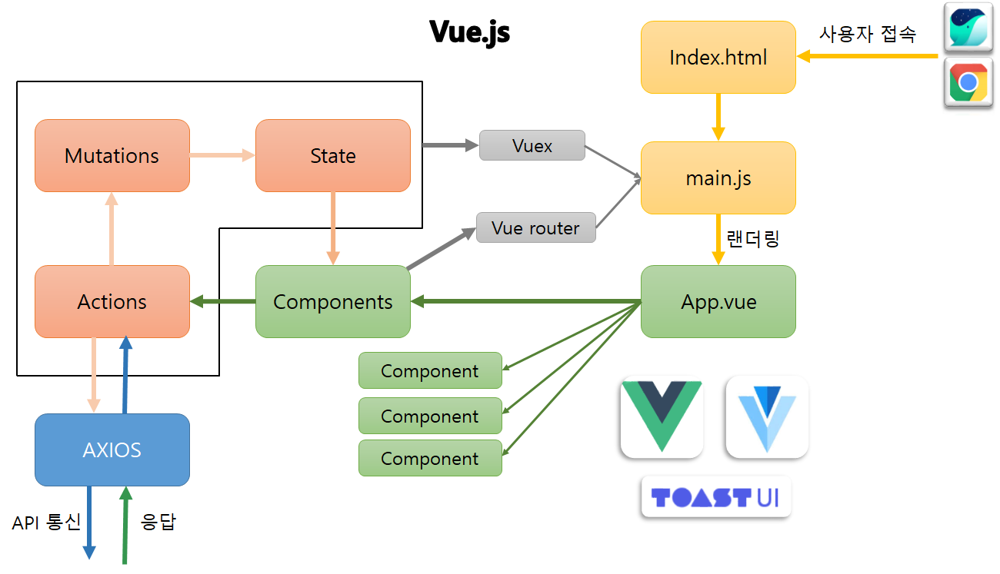
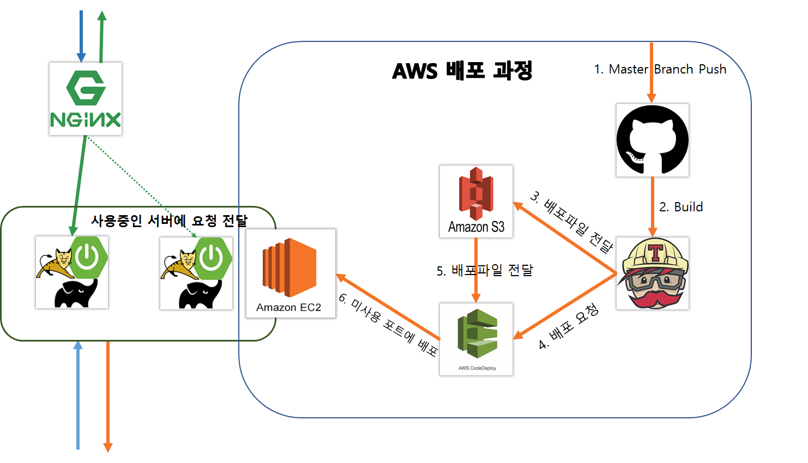
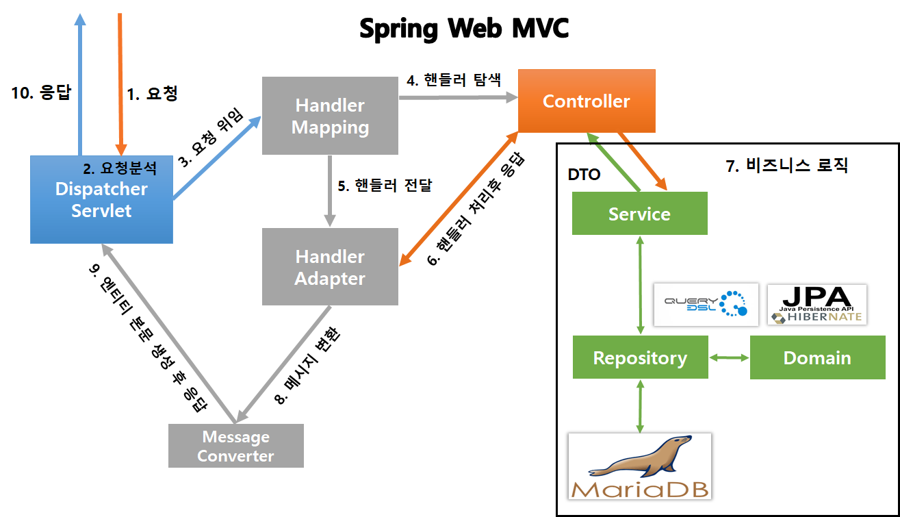
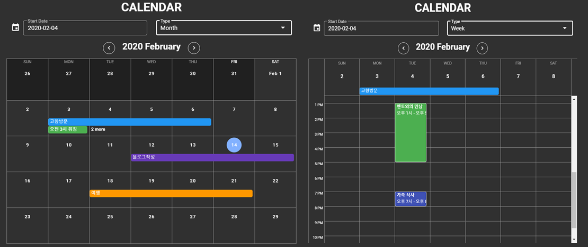

# SpringBoot와 Vue.js를 이용한 웹사이트 제작
> Spring Security OAuth 2.0, JWT 토큰을 활용하여 보안을 적용한다.
> SpringBoot는 최대한 테스트 코드 작성을 하도록 노력한다.

[구현중인 웹사이트로 접속하기](https://naughty-murdock-133815.netlify.com/)

---
## 프로젝트 동작 흐름

---

## 작업환경
#### SpringBoot
 - Java 1.8
 - Gradle
 - SpringBoot 2.2.2 RELEASE  
 - Spring Data JPA
 - Spring Web MVC
 - Spring Sercurify Oauth2
 - Spring AOP

#### Vue
 - Vue
 - Vuex
 - Vue-Router
 - Axios
 - Vuetify
 - Toast-UI Editor

#### 배포
- 서버는 AWS에 배포
- 프론트는 Netlify에 배포
---
## 구현 순서
#### 1. OAuth 2.0 서버 구축
- 기본적인 회원가입 기능을 구현
- Authorization Server 구축
- Resource Server 구축
- Cors 설정
- JWT 토큰 기반으로 인증 구현

#### 2. 회원가입, 로그인 기능 구현
- 회원가입, 로그인 뷰 구현
  - rules를 이용하여 input 검증
- 회원가입, 로그인 API 통신 구현

#### 3. 권한별 라우터 설정, 로그아웃 구현
- 라우터 내비게이션 가드를 이용하여 권한별 페이지 설정
- 로그인 시 페이지 상단의 로그인, 회원가입을 로그아웃으로 변경
- 로그아웃 시 token 정보를 초기화하여 인증 페이지 접속 불가

#### 4. AWS에 무중단 배포 구현
- **EC2, RDS 생성**
  - EC2에 기본적으로 필요한 프로그램 설치
  - RDS는 Maria DB로 사용
    - 이유
      - 가격이 저험
      - Amazon Aurora와 교체가 용이

- **EC2에서 직접 서버 실행**
  - 직접 git clone 후 배포 스크립트를 작성하여 서버 실행

- **배포 자동화**
    - Travis CI 설정
    - AWS S3 생성 후 Travis CI와 연동
    - AWS CodeDeploy 생성 후 Travis CI, S3, CodeDeploy 연동
    - 배포 스크립트 만들어서 배포 자동화

- **무중단 배포**
    - 엔진엑스 설치하여 프로젝트와 연동하기
    - 스크립트 만들기
    - profiles 설정 후 테스트

#### 5. 게시판 기능 구현하기
- Toast UI Editor를 사용
- 기본적인 페이징 및 검색 기능 구현
- 댓글을 계층형으로 구현
  - JPA를 통해 재귀로 구현하여 댓글 수와 관계없이 계층당 한번의 쿼리가 날라가도록 구현

#### 6. 기타 추가 설정
- Vue.js에서 axios interceptor를 이용하여 기본 에러 처리
- 토큰 만료 시
  - Response Error가 토큰 만료라면 Refresh Token으로 자동으로 토큰 재 발급
  - Refresh Token도 만료되었다면 로그아웃 후 사용자에게 알림
- 서버 도메인 등록 후 https 인증 추가
- 서버측에서 HandlerMethodArgumentResolver를 이용하여 Annotation만으로 토큰 사용자의 Email Decodeing
- AOP를 이용하여 컨트롤러 메서드 실행 시간 측정

#### 7. Calendar UI 구현하기

 

- 날짜 클릭시 일정 추가 가능
- 일정 클릭 시 상세한 일정 확인 가능
- 캘린더는 Day, Week, Month 선택 가능
